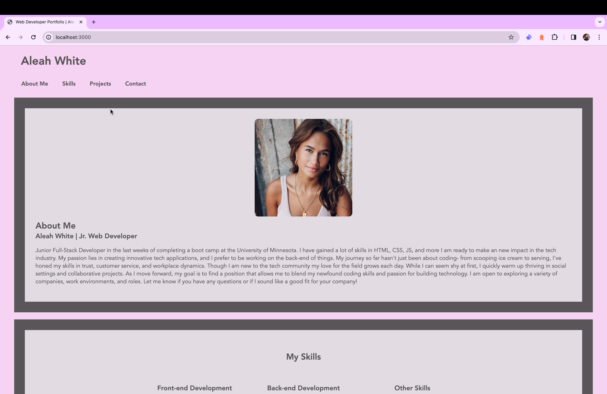

# Challenge 16 - My React Portfolio
 

## Description
A React-based portfolio website showcasing a little bit about me and my skills/projects as a junior web developer . Features include a responsive design, smooth navigation, and an interactive gallery of work, aimed at demonstrating my capabilities in web development

## Table of Contents 
- [Usage](#usage)

- [Credits](#credits)

- [Questions](#questions)

- [License](#license)

## Images/Videos/Links
**Link to Deployed Website:** https://darling-beijinho-620628.netlify.app/

## Usage 
To use this website simply click the deployed link and check the website out!!

## Credits
- React
- JavaScript
- npm

## Questions
If you have any questions/comments about the project, you can email me at [aleahwhite55@gmail.com](mailto:aleahwhite55@gmail.com). For more of my work you can visit my GitHub at [aleahwhite](https://github.com/aleahwhite)!

## License
This project is licensed under the MIT license. For more information, see the [license page](https://spdx.org/licenses/MIT.html).